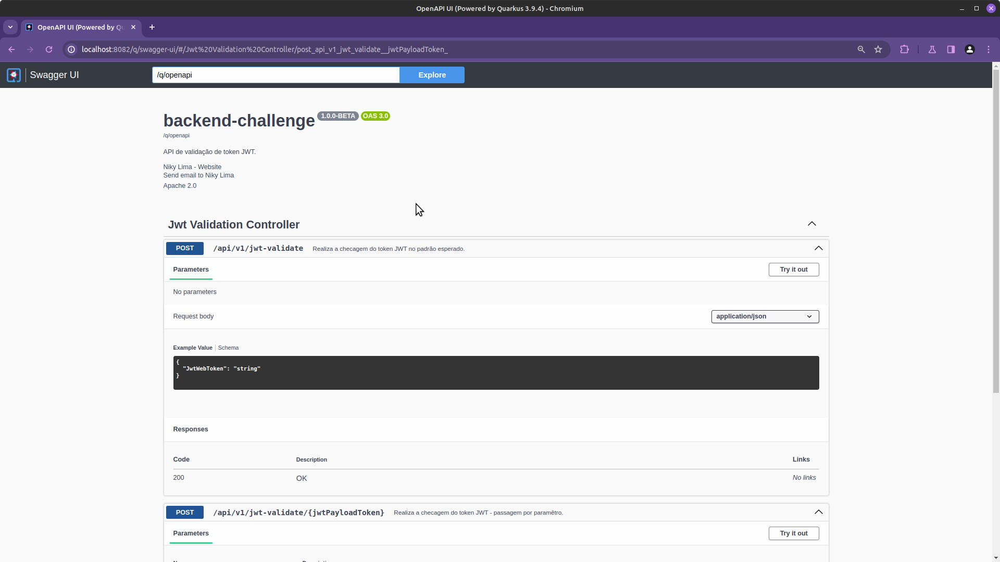
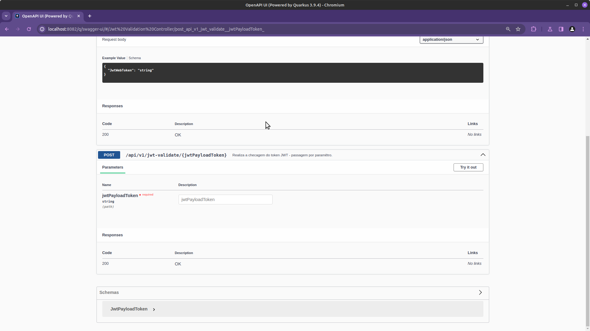
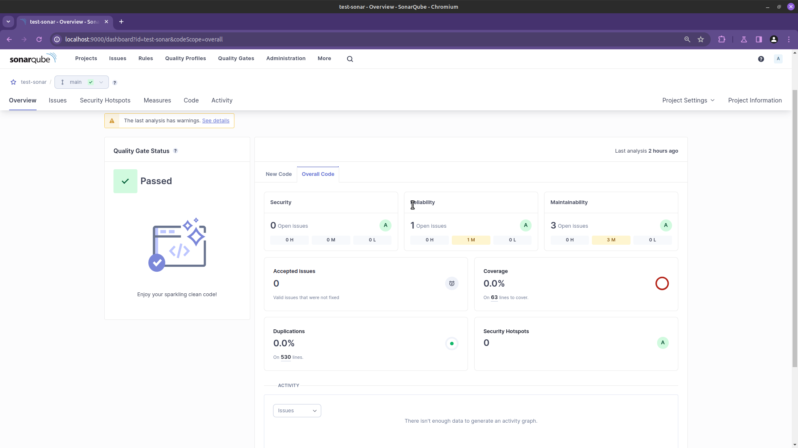
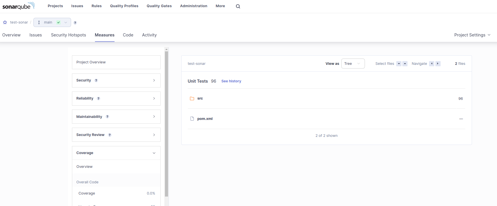

# Challenge Itaú - Oportunidade para Engenheiro de Qualidade

Apresentando o resultado do Challenge realizado pelo Itaú.

## 💻 Tecnologia utilizada

Para o desafio, foi utilizado a plataforma Java na versão 20, Quarkus para a criação da api, JUnit 5 para os testes unitários e RestAssured para os testes de integração.

## 📋 Pré-requisitos

- Java 20 ou superior;
- Docker e Docker Compose;
- Utilizar uma IDE com suporte à linguagem Java - Eclipse, IntelliJ ou Visual Studio Code.

## 🏢 Estrutura do Projeto


- pasta commons - Estão algumas das classes que vão dar suporte as regras do desafio e serão utilizadas pela Service;
- pasta controller - Onde ficará disponibilizada a chamada da api de validação do token JWT;
- pasta service - Onde teremos as validações (regras);
- pasta model - Um modelo simples com a propriedade token JWT.

## 🚀 Realizando o Setup

- O Projeto se encontra no diretório: **backend-challenge/backend-challenge**

1. Clone o repositório;
2. Execute o comando abaixo (Rodando os Testes):
```bash
mvn clean test ou ./mvnw test
```
3. Execute o comando para iniciar a aplicação:
```bash
mvn clean && ./mvnw compile quarkus:dev
```
4. O serviço roda na porta: 8082.
5. Documentação das APIs: http://localhost:8082/q/swagger-ui/

*SCREENSHOT*





### Comandos úteis - Quarkus

#### Gerar um executável:

- No diretório principal do projeto, executar o comando:
```bash
./mvnw clean install -Dnative -DskipTests -DQuarkus.native.container-build=true
```
- Ir para a pasta target/ e dentro dela executar o seguinte comando:
```bash
./backend-challenge-1.0.0-BETA-runner
```
- Gerando uma imagem docker utilizando o Dockerfile.native do Quarkus. No diretório raiz, execute:
```bash
docker build -f src/main/docker/Dockerfile.native -t quarkus/backend-challenge .
```
- Rode a aplicação no conteiner:
```bash
docker run -i --rm -p 8082:8082 quarkus/backend-challenge
```

### Sonar

Utilizei o SonarQube para a validação do código estático, junto ao **jacoco** e o **pitest**.
Infelizmente, não consegui realizar o ajuste do code coverage a tempo. Mas, foi possível
corrigir erros no código e ver a quantidade de unitários realizados.





### Outros documentos

[CHALLENGE](./documentations/CHALLENGE.md)

[CHALLENGE-2](./challenge-2/login_access.feature)
